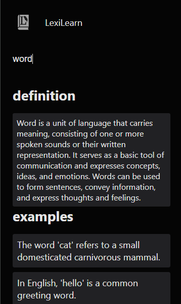
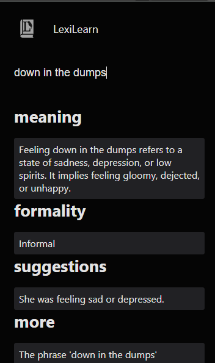

# LexiLearn

LexiLearn is a powerful Chrome extension designed to enhance your language skills and vocabulary. It provides comprehensive information about both individual words and sentences, making it an invaluable tool for learners and language enthusiasts.

## Key Features

- **Word Information**: LexiLearn provides comprehensive word information, including precise definitions, synonyms, and suggestions for optimal usage.

- **Formality Insights**: Discover the formality level of words and phrases, helping you choose the right language for different contexts and situations.

- **Contextual Guidance**: Gain valuable insights into when and how to use specific words effectively, ensuring your communication is precise and impactful.

## usage

there are multiple ways to use LexiLearn. Here are the three primary methods:

1. **By Word**: Provide a word, and LexiLearn will return:
   - Definition
   - Examples of usage
   - Correct word form
   - Synonyms
   - Formality level
   - Detailed usage guidance

2. **By Sentence**: Provide a sentence, and LexiLearn will return:
  - correct_sentence
  - meaning
  - formality
  - suggestions
  - more

3. **By Definition**: Describe a concept or definition, and LexiLearn will provide you with the word you're looking for. For example, if you describe "the feeling of losing hope in life," LexiLearn will suggest words that capture this concept. LexiLearn will return.
  - the word 
  - explanation
  - formality
  - other_suggestions
  - more

> to get the by-definition result make sure to add "?" at the end of the sentence.

4. **hovering over text**: hover over a text and you will get the same result as the word and the sentence input.

## Feature Roadmap

As part of our commitment to continuous improvement and providing the best experience for our users, we have outlined a roadmap for future features and enhancements to the LexiLearn Chrome Extension. Our goal is to make LexiLearn even more valuable and versatile.

### Upcoming Features

Here's a detailed overview of what you can expect in the coming updates:

1. **Caching for Faster Responses**: Implement a local caching mechanism, perhaps using `localStorage` or a database, to store word data that the extension has previously fetched. This will speed up the retrieval of data for words that have been looked up before.

2. **Streaming Markdown Text**: Consider adopting a streaming Markdown text format for results. This approach can make the user experience more responsive and allow partial rendering of data as it's received. Users can start reading definitions and examples while the extension continues to fetch additional information in the background.

3. **Auto-Translation**: If LexiLearn supports multiple languages, consider implementing an auto-translation feature to automatically translate definitions, examples, and other content into the user's preferred language.

4. **User Preferences**: Allow users to set preferences for how they want to receive and display data. This could include defining the level of formality they prefer, customizing the appearance of results, or specifying whether they want to see word usage from specific sources.

5. **Voice Pronunciation**: Add a feature that allows users to hear the pronunciation of a word. This can be especially helpful for language learners.

6. **Word History and Favorites**: Implement a feature that allows users to keep a history of looked-up words and mark certain words as favorites for quick reference.

7. **Usage Statistics**: Provide users with insights into their language learning progress, such as the number of words looked up, the most commonly searched words, or the improvement in their understanding of formal vs. informal language.

8. **Performance Optimization**: Continually work on performance optimization to ensure that the extension runs smoothly without causing any slowdown in the browser. Profile the extension to identify and address bottlenecks.

9. **Cross-Platform Support**: Consider expanding the support of LexiLearn to other browsers and platforms, such as Firefox, Edge, or mobile browsers, to reach a wider user base.

10. **Community Contributions**: Encourage and acknowledge contributions from the community. Provide a clear structure and guidelines for developers interested in contributing to LexiLearn.

11. **Integration with Other Language Learning Tools**: Explore partnerships or integrations with other language learning platforms, apps, or resources to enhance the user experience.

12. **Gamification**: Introduce gamification elements to make language learning more engaging and motivating. Users could earn badges or rewards for their achievements.
